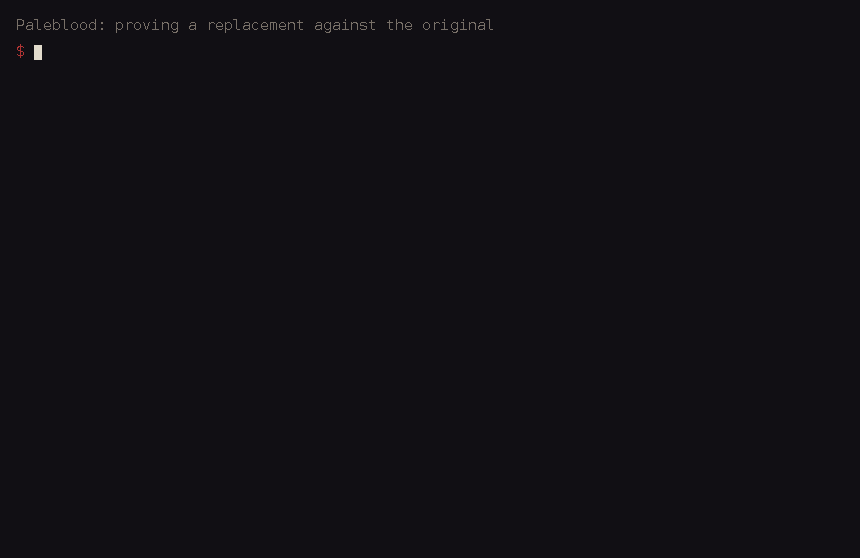

# Paleblood

*A native source port of Bloodborne, rebuilt one verified function at a time.*

**[Start here](https://github.com/Yharnam-Hunters/Paleblood/issues/31)** ·
**[Documentation](https://yharnam-hunters.github.io/byrgenwerth-site/)** ·
[Discussions](https://github.com/Yharnam-Hunters/Paleblood/discussions) ·
[Contributing](CONTRIBUTING.md)

<!-- progress:start -->
| | Functions | Bytes |
|---|---:|---:|
| Target (Ghidra export) | 157757 | 42487347 |
| Replaced | 25 (0.02%) | 14243 (0.03%) |
| Verified | 16 (0.01%) | 13077 (0.03%) |

Generated by `tools/progress.py --update-readme` from `symbols/`. Do not edit.
<!-- progress:end -->



Paleblood replaces the code of Bloodborne's PS4 executable with readable C++, function by
function, until nothing of the original executable is left to run. It is a **functional**
decompilation: a replacement does not have to compile to the same bytes, it has to *behave*
exactly like the original, and every one is proved to, against the original itself.

It is made by people who love this game and want it to outlive the hardware it was made for.

## Where it stands

- The game runs natively on Linux through [bbport](third_party/) with our replacements hooked
  into it, from the title screen through character creation into Iosefka's Clinic.
- The **frame loop** is ours: the clock, the frame limiter, the per-frame step and the frame
  pacing object are replaced and verified, plus functions in the event and kernel layers.
- **`BB_TARGET_FPS=30|60|uncapped`** does in code what the community frame-rate patches do with
  byte edits, and each part is checked against the patch it replaces.
- What happens next is in [STATUS.md](STATUS.md) and the queue in [NEXT.md](NEXT.md).

## How it works

1. **Run the original.** [bbport](third_party/) loads the unmodified executable from your own
   dump and runs it natively on Linux, with a Vulkan renderer derived from shadPS4.
2. **Hook a function.** The game library built from this repository is loaded before any game
   code runs; for every row of [`game/hooks.csv`](game/hooks.csv) the original function's entry
   jumps to our C++ replacement.
3. **Record real inputs.** While the game runs, each replacement records the inputs it reads
   (`runtime/capture.c`). Scripted routes (`game/routes/`) drive unattended runs through the
   menus and into gameplay.
4. **Prove it.** [`tools/verify.py`](docs/VERIFY.md) runs the original machine code and the
   replacement side by side on recorded and hand-written cases and compares return values,
   registers, every byte written and every library call. Deliberately wrong versions must fail.
   Options that replace a community patch are verified against the original *with that patch
   applied*.
5. **Play it.** The game runs with the replacement and behaves as it does without it.

Supporting tools: call-counting probes that show which original functions a run reaches
(`runtime/probe.c`, `tools/probe_list.py`), a map from community patches to the functions they
edit (`tools/patch_overlap.py`), relocated-pointer lookup for functions reached through vtables
(`tools/reloc_refs.py`), and Ghidra scripts for drafts and names (`tools/ghidra/`).

## Options

| Variable | Effect |
|---|---|
| `BB_TARGET_FPS=30`, `60`, `uncapped` | Frame rate target, as the community "30 FPS++", "60 FPS++" and "Uncap FPS++" patches. Unset: the original behaviour, exactly. |
| `BB_LIMITER_WAIT=sleep` | The frame limiter sleeps instead of spinning while it waits (the game carries this wait but never selects it). |

## Getting started

You need Linux, a Vulkan GPU, and a dump of your own copy of the game from your own PS4 (see
Legal below).

```
git clone --recurse-submodules https://github.com/Yharnam-Hunters/Paleblood.git
cd Paleblood
cmake -S . -B build && cmake --build build -j && ctest --test-dir build --output-on-failure
tools/install_hooks.sh
```

[docs/ONBOARDING.md](docs/ONBOARDING.md) goes from your own dump to your first pull request:
preparing the dump (`tools/prepare_dump.sh`), Ghidra with the GhidraOrbis loader
([docs/GHIDRA.md](docs/GHIDRA.md)), building the runtime, a first game run and a first verified
function. [docs/ARCHITECTURE.md](docs/ARCHITECTURE.md) explains the pieces.

## Contributing

One function or cluster per pull request, each verified with `tools/verify.py` and tested in
the game. Every pull request carries a session report (`tools/session_report.py`): what was
named, replaced and verified, the verify results, and the findings and open questions. CI checks
it, along with the build, the tests and the no-game-data rule. **Everyone is welcome:** fork the
repository, pick a good first issue or a target from [NEXT.md](NEXT.md), and read
[CONTRIBUTING.md](CONTRIBUTING.md) first.

## Documentation

- **[The documentation site](https://yharnam-hunters.github.io/byrgenwerth-site/)**: how each
  system works, the devlog, the progress dashboard and the address map. It is also written as a
  place to learn how a console game works and how it is reverse engineered and proved correct;
  no console or game files needed to read it.
- [`docs/systems/`](docs/systems/): one page per game system (generated; changes go through
  issues and pull requests).
- [QUIRKS.md](QUIRKS.md): traps in Ghidra, the PS4 executable and the ABI.
- [docs/VERIFY.md](docs/VERIFY.md): how replacements are proved, cases, captures, probes.

## Layout

| Path | What |
|---|---|
| `game/<system>/` | Replacement code, one directory per game system, with its case generators. |
| `game/hooks.csv` | Hook registry: original address to replacement. |
| `game/routes/` | Pad routes for unattended game runs. |
| `runtime/` | The generic layer: hooks, capture, probes. Nothing specific to this game. |
| `symbols/` | `functions.csv` (what we track) and `ghidra_functions.csv` (every function, the denominator). |
| `tools/` | Verification harness, progress, validators, game runs, Ghidra scripts, hooks. |
| `third_party/bbport/` | The runtime that loads the original executable and our replacements (GPL-2.0-or-later). |
| `docs/` | Onboarding, Ghidra setup, architecture, verification, system pages. |

## Target

CUSA03173 (EU), update v1.09 merged over the base game. Hashes of the executables converted
from SELF to ELF (`target.sha256`); addresses in `symbols/` are PS4 virtual addresses (Ghidra
image base `0x400000`, the same as the community patches). See [QUIRKS.md](QUIRKS.md).

<!-- target:start -->
```
ca8813862d7b1345a6791b7d88cc1d383ede2a6bbc944f39dd3c0e0e3ad9e285  eboot.elf
6552d61af5258817f434c00f759e194c5d97ac97cfc7ce11b1f23aec11f94d0a  libc.elf
8def93e0cd3224619d3d51ddfda8b3dd745e6707d1398fd399d5f04199a7caab  libSceFace.elf
16369566417f7bacd34ebd75f8cffb586563da3e2c40fe8880c60d76718e4833  libSceFios2.elf
6ec2b7bd0cb1dcfe491f3981301c6f30836e34d06e97a1aaaa609580dc2a899a  libSceHand.elf
3f303ae1bd114380729987698b5aa4cfcfeb11d2dc6c9d09f5d6ae9baa53ce18  libSceHeadTracker.elf
b653f26abcf0fd185b4110a6aacc123f7e2e8c0d085f8e5ba1698123213b6659  libSceS3DConversion.elf
a85c286a110f406682dafc97819318eedc9aa1591b79465f1ef9c1929655de8c  libSceSmart.elf
```
<!-- target:end -->

## Legal

- **No game files, ever.** This repository contains no code, assets, binaries, decompiler output
  or extracted data from the game, and never will. What it holds is newly written source, tools
  and documentation. `tools/check_no_game_data.py` runs in the pre-commit hook and in CI and
  rejects anything that looks like game data.
- **Your own console, your own copy.** To build, run or verify anything you need Bloodborne
  (CUSA03173, EU) with the 1.09 update, dumped from your own PS4. The project does not provide
  or point to game files, pkgs, firmware, keys or decryption tools, and requests for or links to
  them are removed ([CONTRIBUTING.md](CONTRIBUTING.md), "Your own copy").
- **No images of the game.** No screenshots, clips or images of the game are kept here or in
  bbport; the checks refuse them. The only images are recordings of our own tools.
- **Not affiliated.** This is a fan project. It is not affiliated with, endorsed by or sponsored
  by Sony Interactive Entertainment or FromSoftware. Bloodborne and related names are trademarks
  of their respective owners.

## License

GPL-2.0-or-later ([LICENSE](LICENSE)). The runtime (bbport) is GPL-2.0-or-later and contains
shadPS4 code, so code that is loaded into its process carries the same license. The license
covers this project's own code only; it grants no right in the game or its code.

*Fear the old blood.*
